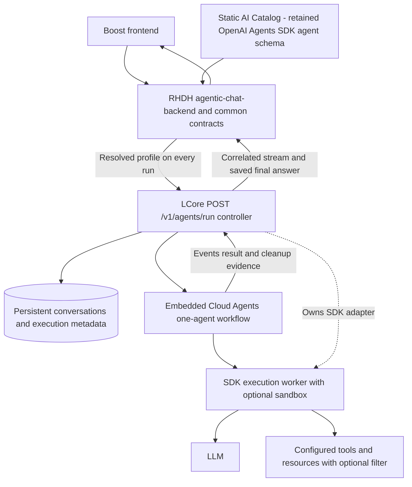

# RHDH LCore and Cloud Agents architecture

Proposed RHDH 2.2 static single-agent execution. The controller is hosted in LCore; cross-agent handoffs are disabled.

```mermaid
flowchart TD
  UI[Boost frontend] --> R[RHDH agentic-chat-backend and common contracts]
  C[Static AI Catalog - retained OpenAI Agents SDK agent schema] --> R
  R -->|Resolved profile on every run| L[LCore POST /v1/agents/run controller]
  L --> H[(Persistent conversations and execution metadata)]
  L --> W[Embedded Cloud Agents one-agent workflow]
  W --> S[SDK execution worker with optional sandbox]
  L -.->|Owns SDK adapter| S
  S --> O[LLM]
  S --> M[Configured tools and resources with optional filter]
  W -->|Events result and cleanup evidence| L
  L -->|Correlated stream and saved final answer| R
  R --> UI
```
