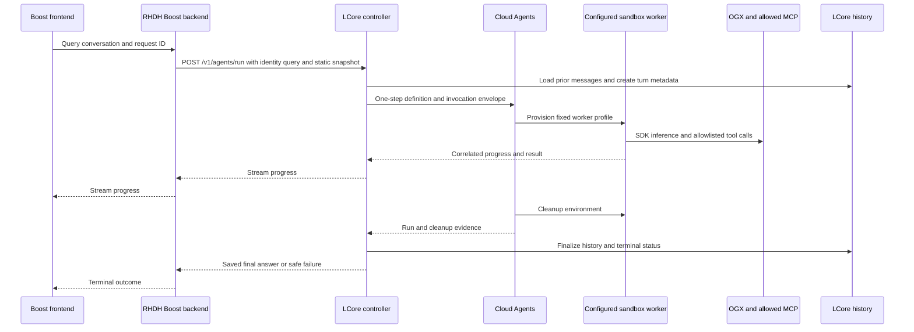

# Single agent request sequence

```mermaid
sequenceDiagram
  participant UI as Boost frontend
  participant R as RHDH Boost backend
  participant L as LCore controller
  participant C as Cloud Agents
  participant S as Configured sandbox worker
  participant O as OGX and allowed MCP
  participant H as LCore history
  UI->>R: Query conversation and request ID
  R->>L: POST /v1/agents/run with identity query and static snapshot
  L->>H: Load prior messages and create turn metadata
  L->>C: One-step definition and invocation envelope
  C->>S: Provision fixed worker profile
  S->>O: SDK inference and allowlisted tool calls
  S-->>L: Correlated progress and result
  L-->>R: Stream progress
  R-->>UI: Stream progress
  C->>S: Cleanup environment
  C-->>L: Run and cleanup evidence
  L->>H: Finalize history and terminal status
  L-->>R: Saved final answer or safe failure
  R-->>UI: Terminal outcome
```
