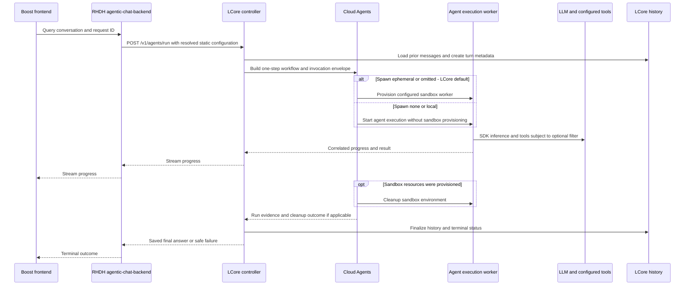

# Single agent request sequence

```mermaid
sequenceDiagram
  participant UI as Boost frontend
  participant R as RHDH agentic-chat-backend
  participant L as LCore controller
  participant C as Cloud Agents
  participant W as Agent execution worker
  participant O as LLM and configured tools
  participant H as LCore history
  UI->>R: Query conversation and request ID
  R->>L: POST /v1/agents/run with resolved static configuration
  L->>H: Load prior messages and create turn metadata
  L->>C: Build one-step workflow and invocation envelope
  alt Spawn ephemeral or omitted - LCore default
    C->>W: Provision configured sandbox worker
  else Spawn none or local
    C->>W: Start agent execution without sandbox provisioning
  end
  W->>O: SDK inference and tools subject to optional filter
  W-->>L: Correlated progress and result
  L-->>R: Stream progress
  R-->>UI: Stream progress
  opt Sandbox resources were provisioned
    C->>W: Cleanup sandbox environment
  end
  C-->>L: Run evidence and cleanup outcome if applicable
  L->>H: Finalize history and terminal status
  L-->>R: Saved final answer or safe failure
  R-->>UI: Terminal outcome
```
