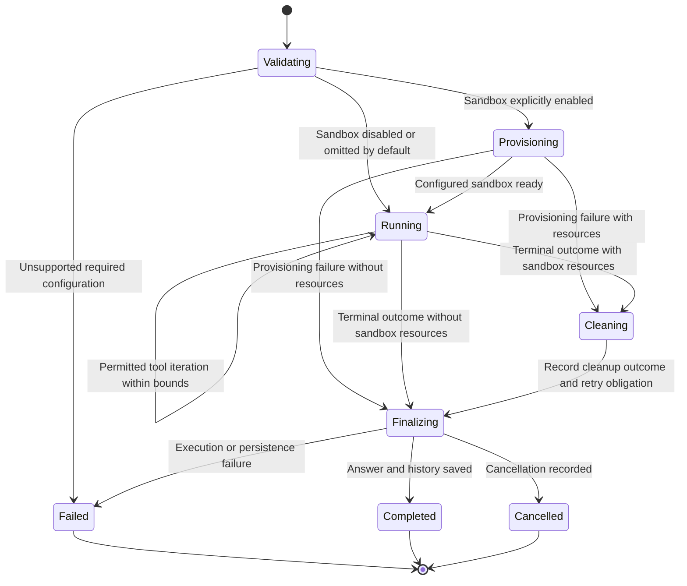

# Execution lifecycle

```mermaid
stateDiagram-v2
  [*] --> Validating
  Validating --> Failed: Unsupported required configuration
  Validating --> Running: Sandbox disabled or omitted by default
  Validating --> Provisioning: Sandbox explicitly enabled
  Provisioning --> Running: Configured sandbox ready
  Provisioning --> Cleaning: Provisioning failure with resources
  Provisioning --> Finalizing: Provisioning failure without resources
  Running --> Running: Permitted tool iteration within bounds
  Running --> Cleaning: Terminal outcome with sandbox resources
  Running --> Finalizing: Terminal outcome without sandbox resources
  Cleaning --> Finalizing: Record cleanup outcome and retry obligation
  Finalizing --> Completed: Answer and history saved
  Finalizing --> Failed: Execution or persistence failure
  Finalizing --> Cancelled: Cancellation recorded
  Failed --> [*]
  Completed --> [*]
  Cancelled --> [*]
```

