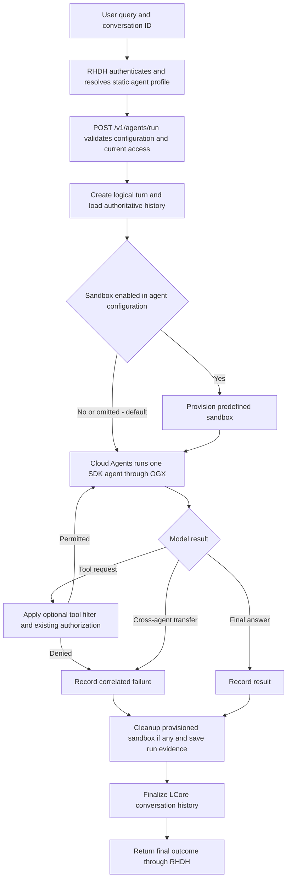

# Single agent workflow

```mermaid
flowchart TD
  Q[User query and conversation ID] --> R[RHDH authenticates and resolves static agent profile]
  R --> C[POST /v1/agents/run validates configuration and current access]
  C --> P[Create logical turn and load authoritative history]
  P --> B{Sandbox enabled in agent configuration}
  B -->|No or omitted - default| A[Cloud Agents runs one SDK agent through OGX]
  B -->|Yes| S[Provision predefined sandbox]
  S --> A
  A --> D{Model result}
  D -->|Tool request| T[Apply optional tool filter and existing authorization]
  T -->|Permitted| A
  T -->|Denied| E[Record correlated failure]
  D -->|Cross-agent transfer| E
  D -->|Final answer| F[Record result]
  E --> X[Cleanup provisioned sandbox if any and save run evidence]
  F --> X
  X --> H[Finalize LCore conversation history]
  H --> U[Return final outcome through RHDH]
```
